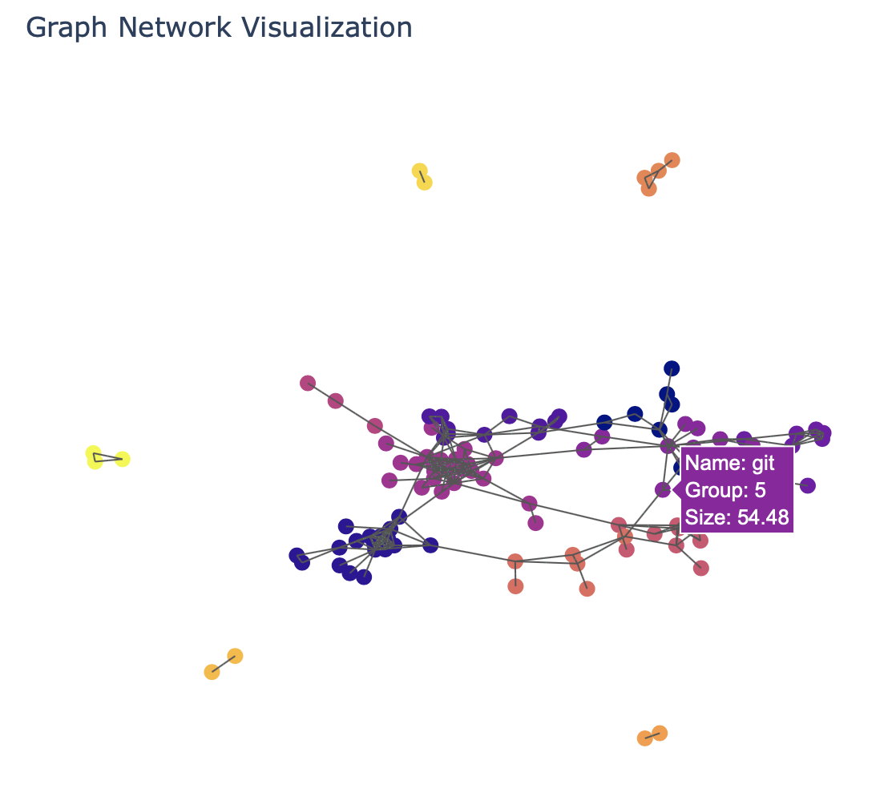
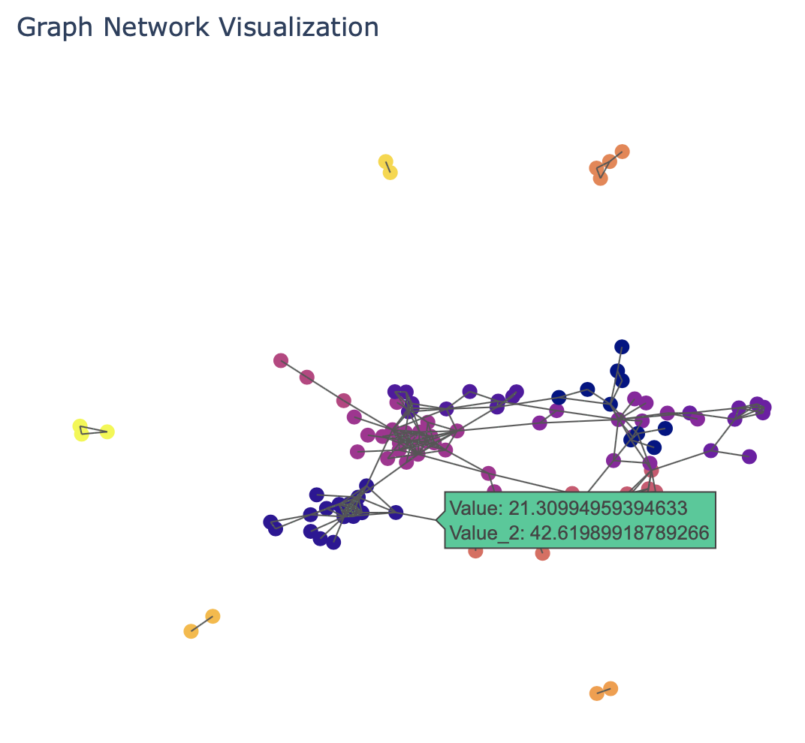

Introduction
------------

This package creates a visualization of a network graph built with
Networkx with hovering functions by Plotly.

Multiple node and edge attributes can be added to the network and shown
in the visualization.

For the full package description go to https://test.pypi.org/project/network-graph-visualization/.

And for the documentation go to the corresponding Homepage at https://network-graph-visualization.readthedocs.io/en/latest/

Prerequisites
-------------

This package requires networkx version >= 2.5 and plotly version >=
4.14.3. See ``pyproject.toml`` for the complete prerequisites.

Installation
------------

Start with install the dependencies: pandas, matplotlib, networkx, plotly, Sphinx.

Install the package through:

::

   pip install -i https://test.pypi.org/simple/ network-graph-visualization

Usage
-----

Below is an example how to use this package. This description also shows
how to add node and edge attributes to the graph from the corresponding
pandas dataframes. The output will be anything similar to the below figures. 

**Create two separate dataframes.** One with information about the nodes and
one with information about the connections. For simplicity, call them
``connections_df`` and ``nodes_df``.

::

   connections_df = pd.read_csv(CONNECTIONS_FILENAME)
   nodes_df = pd.read_csv(NODES_FILENAME)

**Build an empty graph.**

::

   G = nx.Graph()

**Add edge attributes.** Create a column of connections as input for
Networkx. Set these as the index, Convert dataframe to dictionary where
the indices are the key and the attributes the values. Add edges and
their attributes to empty graph.

::

   connections_df['connections'] = list(zip(connections_df['SOURCE_VARIABLE'], connections_df['TARGET_VARIABLE']))
   connections_temp = connections_df[['connections', 'EDGE_ATTRIBUTE_1', 'EDGE_ATTRIBUTE_2']].set_index('connections')
   connections_dict = connections_temp.to_dict('index')
   G.add_edges_from((k[0], k[1], d) for k,d in connections_dict.items())

**Add node attributes.** In contrast to edge attributes node attributes can
be added all at once.

::

   nodes_temp = nodes_df.set_index('NODE_NAME_VARIABLE')
   nodes_dict = nodes_temp.to_dict('index')
   nx.set_node_attributes(G, nodes_dict)

**Call the package.**

::

   import network_graph_visualization.plot
   network_plot = network_graph_visualization.plot.GraphNetwork(G)

**View graph attributes.**

::

   print(network_plot.G.nodes(data=True))
   print(network_plot.G.edges(data=True))

**Optional to add all node and edge attributes as hovering text.**

**Add node hover text.**

::

   NODE_HOVERTEXT = []
   for node in G.nodes():
       NODE_HOVERTEXT.append(
                       "Name: " + node + " " + \
                       "NODE_ATTRIBUTE_1: " + str(network_plot.G.nodes[node]['NODE_ATTRIBUTE_1']) + " " + \
                       "NODE_ATTRIBUTE_2: " + str(network_plot.G.nodes[node]['NODE_ATTRIBUTE_2'])
                       )

**Add edge hover text.**

::

   EDGE_HOVERTEXT = []
   for edge in G.edges():
       EDGE_HOVERTEXT.append(
                       "EDGE_ATTRIBUTE_1: " + str(G.edges[edge]['EDGE_ATTRIBUTE_1']) + " " + \
                       "EDGE_ATTRIBUTE_2: " + str(G.edges[edge]['EDGE_ATTRIBUTE_2'])
                       )

**Run node and edge traces.**

::

   network_plot.trace_nodes(node_color_variable='NODE_ATTRIBUTE_1', node_text=NODE_HOVERTEXT)
   network_plot.trace_edges(edge_text=EDGE_HOVERTEXT) #edge_attribute='EDGE_ATTRIBUTE_2'

**Build visualization.**

::

   network_plot.visualization_attributes(title='TITLE OF THE PLOT')

**Draw and visualize the network.**

::

   network_plot.draw_network(graph_filename='GRAPH_FILENAME.html')

Authors and acknowledgment
--------------------------
Annalie Kruseman 

Feel free to contact me about any questions related to this package.
annaliakruseman@gmail.com

This package has been tested with the Stack Overflow Tag Network as posted on `Kaggle <https://www.kaggle.com/stackoverflow/stack-overflow-tag-network?select=stack_network_links.csv>`_.
